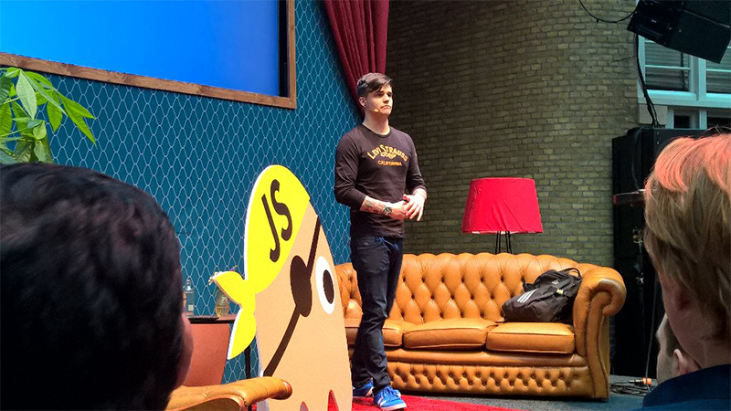
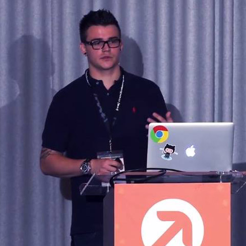

I regularly speak at conferences in Europe and America, if you'd like me to join yours, please email me through <a href="//voux.io/contact" target="_blank">Voux's contact form</a> and we can discuss further.

  <ul>
    <li>
      
    </li>
    <li>
      
    </li>
    <li>
      
    </li>
    <li>
      
    </li>
  </ul>

I'm available for keynote and regular speaking slots, and to maximise exposure and impact of the talk do prefer if sessions are recorded.

### Upcoming events

I'm a Developer Advocate at Telerik, which means some of the below events may be that I'm manning the sponsorship forts for Kendo or NativeScript to talk to developers about our Angular 1/2 and React integrations. However, the majority of the below will be speaking slots so check out the speaker pages if you're thinking of saying hi!

  <ul>
    <li>
      <a href="http://2016.render-conf.com">Render Conf (TBC)</a>, Oxford (England, UK), 21.04.2016
    </li>
    <li>
      <a href="https://voxxeddays.com/ticino/">VoxxedDays</a>, Lugano (Switzerland), 30.04.2016
    </li>
    <li>
      <a href="http://dotnet-cologne.de/">Dotnet Cologne (TBC)</a>, Cologne (Germany), 13.05.2016
    </li>
    <li>
      <a href="https://2016.front-trends.com/speakers/">FrontTrends</a>, Warsaw (Poland), 18.05.2016
    </li>
    <li>
      <a href="http://polyconf.com">PolyConf</a>, Cologne (Germany), 30.06.2016
    </li>
    <li>
      <a href="http://angularcamp.org/">AngularCamp</a>, Barcelona (Spain), 01.07.2016
    </li>
    <li>
      <a href="http://angularconnect.com/2016">AngularConnect</a>, London (England, UK), 27.09.2016
    </li>
  </ul>

### Past events

  <ul>
    <li>
      <a href="http://meetup.com/AngularJS-London/events/229406462/">AngularJS London</a>, London (England, UK), 14.03.2016
    </li>
    <li>
      <a href="https://ng-nl.org">NG-NL</a>, Amsterdam (Netherlands), 18.02.2016
    </li>
    <li>
      <a href="http://www.meetup.com/DeveloperSouthCoast/events/226862117/">DeveloperSouthCoast</a>, Southampton (England, UK), 17.12.2015
    </li>
    <li>
      <a href="http://www.meetup.com/DeveloperSouthCoast/events/226862117/">Falsy Values</a>, Warsaw (Poland), 12.10.2015
    </li>
    <li>
      <a href="http://futureinsights.com">Future Of Web Apps</a>, Boston (USA), 28.10.2014
    </li>
    <li>
      <a href="http://futureinsights.com">Future Of Web Apps</a>, London (England, UK), 30.09.2014
    </li>
    <li>
      <a href="http://futureinsights.com">Future Of Web Design</a>, London (England, UK), 09.04.2014
    </li>
    <li>
      <a href="http://southampton.startupweekend.org">Startup Weekend</a>, Southampton (England, UK), 08.03.2014
    </li>
    <li>
      <a href="http://www.frontendlondon.co.uk">Front End London</a>, London (England, UK), 30.01.2014
    </li>
    <li>
      <a href="http://www.londonwebmeetup.org">London Web</a>, London (England, UK), 16.01.2014
    </li>
  </ul>

